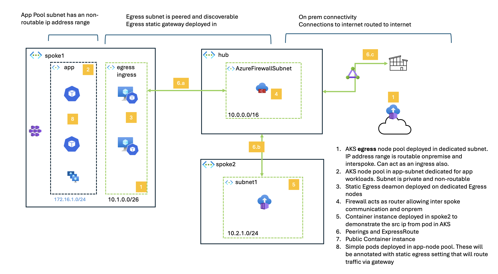
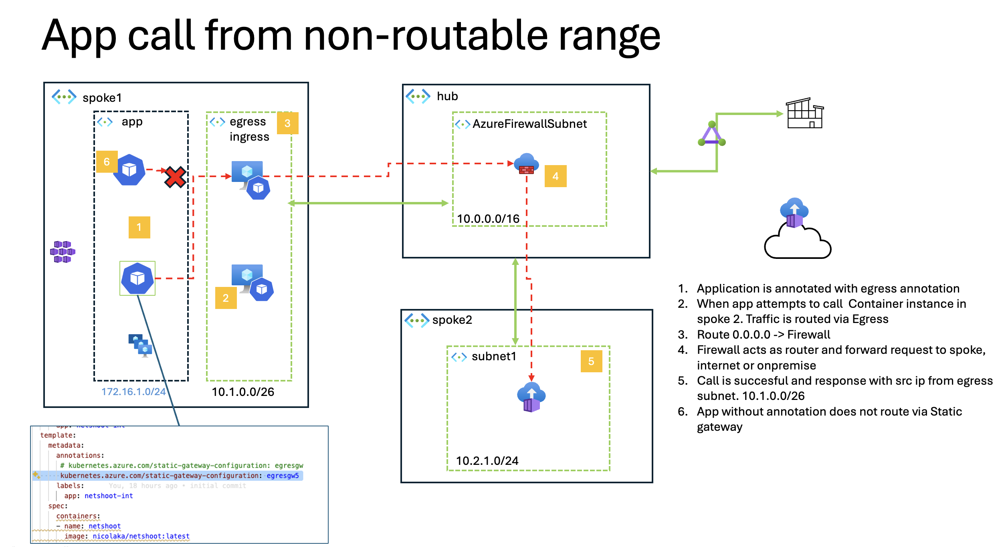

# Azure Hub-and-Spoke AKS Architecture with Static Egress IPs



## 🌟 Architecture Overview

This architecture demonstrates a **multi-address space hub-and-spoke design** with **dual egress patterns** for Azure Kubernetes Service (AKS). The design provides both **high-performance direct internet access** and **security-controlled firewall egress** within a single AKS cluster, enabling workloads to choose their egress path based on compliance and performance requirements.

### Key Architectural Concepts

**🏗️ Multi-Address Space Design**: Spoke1 VNet uses two distinct address spaces (10.1.0.0/22 and 172.16.0.0/22) to segregate traffic flows and provide different egress behaviors within the same cluster.

**🚦 Dual Egress Patterns**:
- **Direct Egress** (172.16.1.0/24): AKS nodes with NAT Gateway for high-throughput, low-latency internet access
- **Controlled Egress** (10.1.0.0/26): AKS nodes routed through Azure Firewall for compliance and security inspection

**🔄 Transitive Routing**: Hub firewall enables secure spoke-to-spoke communication with full traffic inspection and logging capabilities.

**📍 Static IP Guarantee**: Both egress paths use static public IPs, enabling external service whitelisting and consistent audit trails.

### Traffic Flow Patterns



**🌐 End-to-End Traffic Flows**: The diagram above illustrates the complete traffic flow patterns within the hub-and-spoke architecture, showcasing how different types of traffic are routed through the network based on their security and performance requirements.
* pod get annotated with "kubernetes.azure.com/static-gateway-configuration: egresgw5" 
* Traffic to ACI container gets routed to egress nodes 
* Egress nodes can route to the 10.x range 
* ACi Container responds with a egress cidr range confirming the concept
  

#### Key Traffic Flow Scenarios

**🔄 Inter-Spoke Communication**:
- **Spoke1 ↔ Spoke2**: All cross-spoke traffic routes through the Azure Firewall in the hub for security inspection
- **Route Path**: Spoke1 Subnet → Hub Firewall → Spoke2 Subnet
- **Security**: Full packet inspection, logging, and policy enforcement

**🌍 Internet Egress Flows**:
- **Direct Egress** (172.16.1.0/24): App subnet → NAT Gateway → Internet (static public IP)
- **Controlled Egress** (10.1.0.0/26): Egress subnet → Azure Firewall → Internet (static public IP)
- **Hybrid Model**: Single AKS cluster with workloads choosing egress path based on subnet placement

**🔒 Private Connectivity**:
- **API Server Access**: Private endpoints in dedicated subnet (172.16.2.0/28)
- **Internal Services**: Hub DNS resolvers provide private name resolution
- **Management Traffic**: Firewall management subnet isolated from data plane


---

This project implements a comprehensive Azure Hub-and-Spoke network architecture featuring Azure Kubernetes Service (AKS) with **static egress IP patterns**, Azure Firewall, and transitive routing capabilities. The architecture demonstrates how to achieve predictable, consistent egress IP addresses for AKS workloads - enabling external service integrations and compliance requirements through subnet-based routing rather than dynamic pod scheduling.

## 🏗️ Architecture Concept

### Hub-and-Spoke Network Topology with Static Egress IPs

The **Hub-and-Spoke** architecture is a network design pattern that centralizes shared services in a hub virtual network while distributing workloads across multiple spoke virtual networks. This implementation specifically focuses on **static egress IP management** for AKS workloads, ensuring predictable and consistent outbound IP addresses for external service integrations and compliance requirements.

**Key Design Principles:**
- **Static Egress IPs**: Predictable, consistent egress IP addresses for external integrations
- **Subnet-Based Routing**: Network-level traffic steering rather than application-level routing
- **Dual Egress Patterns**: Demonstrates both direct and firewall-controlled internet access
- **Centralized Security**: Single point of egress control via Azure Firewall for sensitive workloads

**This architecture solves real-world challenges:**
- **External Service Integration**: Third-party APIs and services can whitelist specific IP ranges
- **Compliance Requirements**: Predictable egress IPs enable consistent audit trails and reporting
- **Network Monitoring**: Simplified egress traffic analysis with known, static IP addresses

### Key Components

#### 🏢 Hub VNet (10.0.0.0/16)
- **Azure Firewall Subnet** (10.0.2.0/24): Central security appliance for traffic filtering and NAT
- **Management Subnet** (10.0.3.0/24): Firewall management plane  
- **General Services** (10.0.1.0/24): Shared infrastructure components
- **DNS Resolver** (10.0.10.0/28, 10.0.20.0/28): Private DNS resolution

#### 🏭 Spoke1 VNet - Multi-Address Space AKS
**Address Space 1: 10.1.0.0/22** (Firewall-routed)
- **Egress Subnet** (10.1.0.0/26): AKS nodes with controlled egress via Azure Firewall

**Address Space 2: 172.16.0.0/22** (Direct-routed)  
- **App Subnet** (172.16.1.0/24): AKS nodes with direct internet access via NAT Gateway
- **API Server Subnet** (172.16.2.0/28): Private AKS API server endpoints
- **ACI Subnet** (172.16.3.0/24): Available for container instances

#### 🏭 Spoke2 VNet (10.2.0.0/22) - Container Services
- **ACI Subnet** (10.2.1.0/24): Active Azure Container Instances deployment

### Static Egress Architecture Deep Dive


#### 🎯 Static Egress Architecture Strategy

The architecture implements **subnet-based static egress** to handle different egress requirements:

```text
┌─────────────────────────────────────────────────────────────────┐
│                    AKS Cluster Architecture                     │
├─────────────────────────────────────────────────────────────────┤
│   App Subnet              │         Egress Subnet               │
│   (172.16.1.0/24)         │         (10.1.0.0/26)              │
│                           │                                     │
│ ┌─────────────────────────┐ │ ┌───────────────────────────────────┐ │
│ │ NAT Gateway Egress      │ │ │ Azure Firewall Egress             │ │
│ │ Static Public IPs       │ │ │ Static Public IPs                 │ │
│ │ Direct Internet         │ │ │ Security-Controlled               │ │
│ │ High Performance        │ │ │ Full Traffic Inspection           │ │
│ └─────────────────────────┘ │ └───────────────────────────────────┘ │
│                           │                                     │
│ Route: 0.0.0.0/0 →        │ Route: 0.0.0.0/0 →                  │
│        NAT Gateway        │        Azure Firewall               │
└─────────────────────────────────────────────────────────────────┘
```


#### 🚦 Static Egress Traffic Patterns


##### 1. NAT Gateway Egress (App Subnet)


- **Target**: High-throughput applications, CDN integration, real-time services
- **Path**: App Subnet → NAT Gateway → Static Public IPs → Internet
- **Benefits**: Minimal latency, maximum throughput, cost-effective for bulk traffic
- **Static IP**: Predictable egress IPs for external service whitelisting


##### 2. Firewall Egress (Egress Subnet)


- **Target**: Financial services, healthcare, government workloads
- **Path**: Egress Subnet → Azure Firewall → Static Public IPs → Internet
- **Benefits**: Full inspection, logging, compliance, threat protection
- **Static IP**: Consistent firewall public IPs for security policies


##### 3. Route Table Control


- **Implementation**: Static routes determine egress path based on subnet placement
- **Flexibility**: Workloads can be placed in appropriate subnets based on requirements
- **Predictability**: No dynamic routing decisions - consistent egress behavior


#### 🛡️ Static Egress IP Strategy


The architecture implements **static egress IP** patterns to provide:

- **Predictable Egress**: Consistent, known IP addresses for external service whitelist
- **Compliance Control**: Guaranteed egress paths for regulatory requirements
- **Network Policies**: Fine-grained control over which workloads use which egress paths
- **Audit Trail**: Complete visibility into egress traffic patterns and destinations
- **Failover Design**: Redundant egress paths for high availability scenarios


#### 📊 Static Egress Concepts

**Egress Path Determination**:

The architecture uses **subnet-based egress routing** rather than dynamic pod scheduling:

- **App Subnet (172.16.1.0/24)**: Workloads with direct internet access get predictable NAT gateway IPs
- **Egress Subnet (10.1.0.0/26)**: Security-controlled workloads get static firewall public IPs
- **Route Table Control**: Static routes determine egress path based on subnet placement

**Benefits of Static Egress**:
- **External Service Integration**: Third-party services can whitelist specific IP ranges
- **Compliance Reporting**: Simplified audit trails with known egress IPs
- **Network Monitoring**: Easier to track and analyze egress traffic patterns
- **Security Policies**: Consistent application of security rules per egress path

### Transitive Routing

**Transitive Routing** enables spoke1 ↔ spoke2 communication through the hub firewall:

- Traffic between spokes is inspected and controlled by Azure Firewall
- Firewall policies define which inter-spoke communication is allowed
- Route tables direct cross-spoke traffic through the firewall
- Full network visibility and logging for compliance

### Security Model


#### Two-Tier Internet Access


- **Direct Access**: App subnet → Internet (performance-optimized). This is only to demostrate 
- **Controlled Access**: Egress subnet → Azure Firewall → Internet (security-controlled)


#### Network Segmentation


- **VNet Peering**: Controlled connectivity between hub and spokes
- **NSG Rules**: Subnet-level traffic filtering
- **Firewall Policies**: Application and network-level inspection

## 🌐 Static Egress IP Benefits

### Why Static Egress IPs Matter

**Traditional Challenge**: Dynamic pod scheduling and NAT can result in unpredictable egress IP addresses, making it difficult to:
- Whitelist IP ranges with external services
- Maintain consistent security policies
- Provide audit trails for compliance

**Static Egress Solution**: This architecture provides predictable, consistent egress IP addresses through:
- **Subnet-based routing**: Traffic egress determined by subnet placement, not pod scheduling
- **Static public IPs**: Both NAT Gateway and Azure Firewall use pre-allocated static public IPs
- **Route table control**: Explicit routing rules ensure consistent egress paths


## 🚀 Getting Started

### Prerequisites

- Azure CLI (latest version)
- Bash shell (macOS/Linux/WSL)
- Helm 3.x (for AKS deployments)
- kubectl (for Kubernetes management)
- Azure subscription with appropriate permissions

### Quick Start

1. **Clone the repository**
   ```bash
   git clone <repository-url>
   cd subnetpeeredaks
   ```

2. **Configure deployment parameters**
   ```bash
   # Edit the PREFIX and LOCATION in deployoss.sh
   vim deployoss.sh
   ```

3. **Deploy the complete architecture**
   ```bash
   ./deployoss.sh
   ```

4. **Verify deployment**
   ```bash
   ./diagnose-connectivity.sh
   ```

## 📋 Usage Instructions

### Individual Step Deployment

The deployment script supports modular execution for targeted updates:

```bash
# Deploy networking only
./deployoss.sh --step networking

# Deploy firewall rules
./deployoss.sh --step firewall

# Deploy route tables  
./deployoss.sh --step routes

# View architecture summary
./deployoss.sh --step summary

# Deploy AKS cluster
./deployoss.sh --step aks

# Create test workloads
./deployoss.sh --step workloads

# Deploy ACI containers
./deployoss.sh --step aci

# Create egress node pool
./deployoss.sh --step egress-pool

# Install kube-egress-gateway
./deployoss.sh --step helm-values

# Deploy test manifests
./deployoss.sh --step testdeploy
```

### Deployment Options


#### Full Deployment (Recommended)

```bash
# Deploy all components with progress tracking
ENABLE_PROGRESS=true ./deployoss.sh

# Deploy all components without progress tracking
ENABLE_PROGRESS=false ./deployoss.sh
```


#### Custom Configuration

Modify variables in `deployoss.sh`:
```bash
PREFIX="87"                                    # Resource name prefix
LOCATION="swedencentral"                       # Azure region
NODE_SIZE="Standard_DS3_v2"                   # AKS node size
K8S_VERSION="1.31"                            # Kubernetes version
```

### Testing Static Egress Configuration


#### 1. Verify Static Egress IPs

```bash
# Get NAT Gateway public IP (App Subnet egress)
az network public-ip show --name 87-nat-pip --resource-group 87-aks-egress --query "ipAddress" -o tsv

# Get Azure Firewall public IP (Egress Subnet egress)
az network public-ip show --name 87-firewall-pip --resource-group 87-aks-egress --query "ipAddress" -o tsv

# Test egress from app subnet (should use NAT Gateway IP)
kubectl run test-app-egress --image=busybox --rm -it --restart=Never \
  --overrides='{"spec":{"nodeSelector":{"agentpool":"nodepool1"}}}' \
  -- wget -qO- http://httpbin.org/ip

# Test egress from egress subnet (should use Firewall IP)
kubectl run test-egress-subnet --image=busybox --rm -it --restart=Never \
  --overrides='{"spec":{"nodeSelector":{"agentpool":"egresspool"}}}' \
  -- wget -qO- http://httpbin.org/ip
```


#### 2. Test Transitive Routing (Spoke1 ↔ Spoke2)

```bash
# Get ACI IP address
ACI_IP=$(az container show --name srcip-http2 --resource-group 87-aks-egress --query "ipAddress.ip" -o tsv)

# Test from spoke1 to spoke2 (should show firewall IP as source)
kubectl run test-transitive --image=busybox --rm -it --restart=Never \
  -- wget -qO- http://$ACI_IP:8080

# Test from spoke2 to spoke1 (requires AKS service)
az container exec --resource-group 87-aks-egress --name srcip-http2 \
  --exec-command "/bin/sh -c 'curl -I http://10.1.2.4:80'"
```


#### 3. Monitor Firewall Traffic

```bash
# View firewall logs
az monitor activity-log list --resource-group 87-aks-egress \
  --max-events 10 --query "[].{Time:eventTimestamp, Operation:operationName.value}"

# Check firewall rules
az network firewall policy rule-collection-group list \
  --policy-name 87-firewall-policy --resource-group 87-aks-egress
```

### Troubleshooting


#### Run Diagnostics

```bash
# Comprehensive connectivity diagnosis
./diagnose-connectivity.sh
```


#### Common Issues


1. **Spoke1 → Spoke2 connectivity fails**
   - Verify full VNet peering (not subnet-level)
   - Check firewall rules allow inter-spoke traffic
   - Confirm route tables point to firewall

2. **Internet access blocked from egress subnet**
   - Verify firewall rules allow outbound traffic
   - Check route table points 0.0.0.0/0 to firewall
   - Confirm firewall has public IP

3. **AKS deployment issues**
   - Verify managed identity permissions
   - Check subnet delegations for AKS
   - Confirm API server subnet configuration


#### Manual Fixes

```bash
# Fix VNet peering
./deployoss.sh --step networking

# Update firewall rules
./deployoss.sh --step firewall

# Reconfigure routing
./deployoss.sh --step routes
```

## 🔧 Customization

### Adding New Spokes

1. **Update `create_networking()` function**:
   ```bash
   # Add new spoke VNet
   az network vnet create --name spoke3 \
     --resource-group $RESOURCE_GROUP \
     --address-prefix 10.3.0.0/16
   
   # Add peering
   az network vnet peering create --name hub1_to_spoke3 \
     --resource-group $RESOURCE_GROUP \
     --vnet-name hub1 --remote-vnet spoke3 \
     --allow-forwarded-traffic --allow-vnet-access
   ```

2. **Update firewall rules** for new spoke communication

3. **Add route tables** for the new spoke subnets

### Modifying Firewall Policies

Edit the `create_firewall()` function to add custom rules:
```bash
# Example: Allow specific port from spoke1 to spoke2
az network firewall policy rule-collection-group collection add-filter-collection \
  --collection-priority 170 \
  --name "AllowSpecificPort" \
  --action Allow \
  --rule-name "AllowHTTP" \
  --rule-type NetworkRule \
  --destination-addresses "10.2.0.0/16" \
  --destination-ports "80" \
  --ip-protocols "TCP" \
  --source-addresses "10.1.0.0/16"
```

## 📁 Project Structure

```
subnetpeeredaks/
├── deployoss.sh                 # Main deployment script
├── diagnose-connectivity.sh     # Troubleshooting script  
├── testdeploy.yaml              # Kubernetes test manifest
├── test-transitive-routing.md   # Architecture verification
├── helmosss/
│   ├── values.template.yaml     # Helm values template
│   └── values.yaml             # Generated Helm values
└── README.md                   # This documentation
```


## 🛡️ Security Considerations

### Network Security
- ✅ All inter-spoke traffic inspected by firewall
- ✅ NSGs provide subnet-level protection
- ✅ Private endpoints for AKS API servers
- ✅ No direct spoke-to-spoke connectivity


## Network Details

### Hub Network

- Address space: 10.0.0.0/16
- Subnets:
  - AzureFirewallSubnet: 10.0.2.0/24
  - AzureFirewallManagementSubnet: 10.0.3.0/24
  - subnet-1: 10.0.1.0/24
  - dns-inbound-subnet: 10.0.10.0/28
  - dns-outbound-subnet: 10.0.20.0/28

### Spoke Networks

- Spoke 1 (Multi-Address Space Architecture):
  - Address space 1: 10.1.0.0/22 (Routable through firewall)
    - egress-subnet: 10.1.0.0/26 - Controlled egress through firewall
  - Address space 2: 172.16.0.0/22 (Non-routable private range)
    - app-subnet: 172.16.1.0/24 - AKS app nodes with direct internet access
    - apiserver-subnet: 172.16.2.0/28 - AKS API server private endpoint
    - aci-subnet: 172.16.3.0/24 - Container instances (unused)

- Spoke 2:
  - Address space: 10.2.0.0/22
  - Subnets:
    - aci-subnet-spoke2: 10.2.1.0/24 - Active ACI deployment

## 📊 Network Architecture Table

| VNet | Address Space | Subnet Name | Subnet CIDR | Purpose | Egress Path | Notes |
|------|---------------|-------------|-------------|---------|-------------|-------|
| **hub1** | 10.0.0.0/16 | AzureFirewallSubnet | 10.0.2.0/24 | Azure Firewall | N/A | Central firewall for traffic inspection |
| | | AzureFirewallManagementSubnet | 10.0.3.0/24 | Firewall Management | N/A | Management plane for firewall |
| | | subnet-1 | 10.0.1.0/24 | General Hub Services | Direct | General hub infrastructure |
| | | dns-inbound-subnet | 10.0.10.0/28 | DNS Resolver Inbound | N/A | Private DNS resolution |
| | | dns-outbound-subnet | 10.0.20.0/28 | DNS Resolver Outbound | N/A | Private DNS forwarding |
| **spoke1** | 10.1.0.0/22 | egress-subnet | 10.1.0.0/26 | AKS Egress Nodes | Via Firewall | Controlled egress through firewall |
| | 172.16.0.0/22 | app-subnet | 172.16.1.0/24 | AKS App Nodes | Direct Internet | High-performance direct egress |
| | | apiserver-subnet | 172.16.2.0/28 | AKS API Server | Private | Private API server endpoint |
| | | aci-subnet | 172.16.3.0/24 | Container Instances | Direct Internet | Unused - available for ACI |
| **spoke2** | 10.2.0.0/22 | aci-subnet-spoke2 | 10.2.1.0/24 | ACI Containers | Direct Internet | Active ACI deployment |

### Multi-Address Space Benefits

| Feature | 10.1.0.0/22 (Routable) | 172.16.0.0/22 (Private) |
|---------|-------------------------|--------------------------|
| **Purpose** | Firewall-controlled egress | Non-routable app workloads |
| **Egress Control** | All traffic via Azure Firewall | Direct internet or firewall for inter-VNet |
| **Security Level** | High - full inspection | Medium - network-level filtering |
| **Performance** | Moderate (firewall overhead) | High (direct routing) |
| **Use Cases** | Compliance workloads, sensitive data | High-throughput apps, internal services |
| **IP Allocation** | Smaller /26 for efficiency | Larger /24 for application density |

## 🌐 Complete IP Range Documentation

### VNet and Subnet Configuration Details

#### Hub VNet (hub1) - Complete Breakdown
| **Subnet Name** | **CIDR** | **IPs Available** | **Purpose** | **Service Delegation** |
|-----------------|----------|-------------------|-------------|----------------------|
| subnet-1 | 10.0.1.0/24 | 251 | General hub services | None |
| AzureFirewallSubnet | 10.0.2.0/24 | 251 | Azure Firewall | None |
| AzureFirewallManagementSubnet | 10.0.3.0/24 | 251 | Firewall management | None |
| dns-inbound-subnet | 10.0.10.0/28 | 11 | DNS resolver inbound | Microsoft.Network/dnsResolvers |
| dns-outbound-subnet | 10.0.20.0/28 | 11 | DNS resolver outbound | Microsoft.Network/dnsResolvers |

#### Spoke1 VNet (spoke1) - Multi-Address Space Details
| **Subnet Name** | **CIDR** | **IPs Available** | **Purpose** | **Address Space** | **Egress Path** | **Service Delegation** |
|-----------------|----------|-------------------|-------------|-------------------|-----------------|----------------------|
| egress-subnet | 10.1.0.0/26 | 59 | AKS egress nodes | 10.1.0.0/22 | Via Azure Firewall | None |
| app-subnet | 172.16.1.0/24 | 251 | AKS app nodes | 172.16.0.0/22 | Direct Internet | None |
| apiserver-subnet | 172.16.2.0/28 | 11 | AKS API server | 172.16.0.0/22 | Private endpoint | Microsoft.ContainerService/managedClusters |
| aci-subnet | 172.16.3.0/24 | 251 | Container instances (unused) | 172.16.0.0/22 | Direct Internet | Microsoft.ContainerInstance/containerGroups |

#### Spoke2 VNet (spoke2) - Container Services
| **Subnet Name** | **CIDR** | **IPs Available** | **Purpose** | **Egress Path** | **Service Delegation** |
|-----------------|----------|-------------------|-------------|-----------------|----------------------|
| aci-subnet-spoke2 | 10.2.1.0/24 | 251 | ACI containers (active) | Direct Internet | Microsoft.ContainerInstance/containerGroups |

### Kubernetes IP Configuration

#### AKS Cluster IP Ranges
| **Component** | **CIDR** | **Total IPs** | **Purpose** |
|---------------|----------|---------------|-------------|
| Pod CIDR | 192.168.0.0/16 | 65,536 | Kubernetes pod IP addresses |
| Service CIDR | Default (10.0.0.0/16) | 65,536 | Kubernetes service IP addresses |

> **Note**: Service CIDR uses the default AKS range and should not conflict with VNet ranges.

### Address Space Utilization Analysis

#### IP Range Allocation Summary
| **Range Type** | **Network** | **Size** | **Utilization** | **Growth Capacity** |
|----------------|-------------|----------|-----------------|-------------------|
| **Hub Infrastructure** | 10.0.0.0/16 | /16 | ~1,300 IPs used | High |
| **Spoke1 Routable** | 10.1.0.0/22 | /22 | ~60 IPs used | Medium |
| **Spoke1 Private** | 172.16.0.0/22 | /22 | ~260 IPs used | Medium |
| **Spoke2** | 10.2.0.0/22 | /22 | ~250 IPs used | Medium |
| **Pod Network** | 192.168.0.0/16 | /16 | Variable | High |

#### Reserved IP Calculations
> Azure reserves the first 4 IPs and last 1 IP in each subnet:
> - **x.x.x.0**: Network address
> - **x.x.x.1**: Default gateway
> - **x.x.x.2**: Azure DNS mapping
> - **x.x.x.3**: Azure DNS mapping  
> - **x.x.x.255**: Network broadcast address

### Internet Egress Configuration

#### Static IP Egress Patterns
| **Subnet** | **Egress Method** | **Static IP Source** | **Security Level** |
|------------|-------------------|---------------------|-------------------|
| egress-subnet (10.1.0.0/26) | Azure Firewall | Firewall Public IP | High - Full inspection |
| app-subnet (172.16.1.0/24) | Direct Internet | NAT Gateway Public IP | Medium - Network level |
| aci-subnet-spoke2 (10.2.1.0/24) | Direct Internet | Default Azure egress | Low - Outbound only |

### Inter-VNet Routing Configuration

#### Transitive Routing Rules
| **Source** | **Destination** | **Next Hop** | **Route Type** |
|------------|-----------------|--------------|----------------|
| 10.1.0.0/22 | 10.2.0.0/22 | Azure Firewall | User-defined |
| 172.16.0.0/22 | 10.2.0.0/22 | Azure Firewall | User-defined |
| 10.2.0.0/22 | 10.1.0.0/22 | Azure Firewall | User-defined |
| 10.2.0.0/22 | 172.16.0.0/22 | Azure Firewall | User-defined |

### Security Boundaries and Network Segmentation

#### Security Zone Configuration
| **Security Zone** | **IP Ranges** | **Access Control** | **Inspection Level** |
|-------------------|---------------|-------------------|---------------------|
| **Hub Services** | 10.0.0.0/16 | Azure Firewall + NSGs | Full |
| **Controlled Egress** | 10.1.0.0/26 | Azure Firewall + NSGs | Full |
| **Direct Egress** | 172.16.1.0/24 | NSGs only | Network level |
| **Private Endpoints** | 172.16.2.0/28 | NSGs + Private Link | Full |
| **Container Services** | 10.2.1.0/24, 172.16.3.0/24 | NSGs only | Network level |

### Scalability and Growth Planning

#### Capacity Analysis
| **Component** | **Current Allocation** | **Maximum Capacity** | **Expansion Strategy** |
|---------------|----------------------|---------------------|----------------------|
| **Hub VNet** | ~1,300/65,536 IPs | 65,536 | Add subnets within existing /16 |
| **Spoke1 Egress** | ~60/1,024 IPs | 1,024 | Expand subnet or add new spoke |
| **Spoke1 Apps** | ~260/1,024 IPs | 1,024 | Expand subnet or add new spoke |
| **Spoke2** | ~250/1,024 IPs | 1,024 | Expand subnet or add new spoke |
| **Pod Network** | Variable/65,536 IPs | 65,536 | Use cluster autoscaler |

### RFC 1918 Private Address Space Usage

#### Address Space Distribution
- **10.0.0.0/8**: Hub and primary spoke infrastructure
- **172.16.0.0/12**: Private app workloads and API servers  
- **192.168.0.0/16**: Kubernetes pod network overlay

#### Multi-Address Space Architecture Benefits
1. **Segregated Traffic Control**: Separate egress policies for different workload types
2. **Network Efficiency**: Smaller subnets reduce broadcast domains
3. **Security Isolation**: Non-routable ranges for sensitive workloads
4. **Compliance Ready**: Predictable egress IPs for external service whitelisting
5. **Cost Optimization**: Direct internet access for high-throughput workloads

## 📝 Legacy Notes and Development History

### Architecture Evolution
This project evolved from a simple subnet peering implementation to a comprehensive hub-and-spoke architecture with:
- Full VNet peering (replacing subnet-level peering)
- Transitive routing capabilities
- Azure Firewall integration
- AKS with Cilium CNI
- Container instance deployments

### Migration from Previous Versions
If upgrading from earlier versions:
1. VNet peering changed from subnet-level to full VNet peering
2. Firewall rules updated for better transitive routing
3. Route tables restructured for proper spoke-to-spoke communication

---

**This architecture represents a production-ready, enterprise-grade Azure networking solution optimized for security, performance, and scalability.** 
  